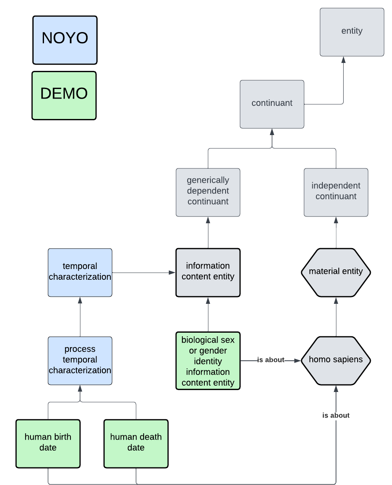

# DEMO Ontology Documentation

[//]: # "This file is meant to be edited by the ontology maintainer."

Welcome to the DEMO documentation!

You can find descriptions of the standard ontology engineering workflows [here](odk-workflows/index.md).

## DEMO schema

## Classes

|IRI         |value                                                       |def                                                                                            |
|------------|------------------------------------------------------------|-----------------------------------------------------------------------------------------------|
|DEMO_0000003|human death date                                            |A process temporal specification that is about the date of death of an homo sapiens.           |
|DEMO_0000002|human birth date                                            |A process temporal specification that is about the birth date of an homo sapiens.              |
|DEMO_0000001|biological sex or gender identity information content entity|An information content entity that is intended to denote a biological sex or a gender identity.|

